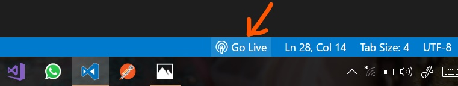
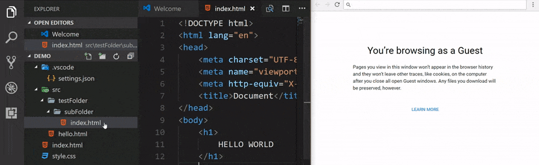
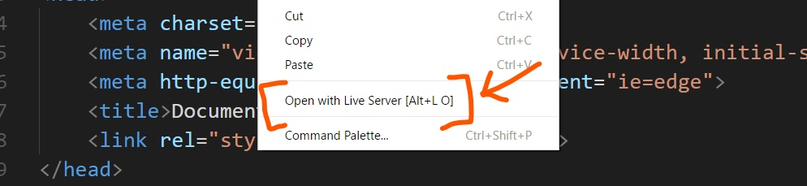

_[Wanna try [LIVE SERVER++](https://github.com/ritwickdey/vscode-live-server-plus-plus) (BETA) ? It'll enable live changes without saving file.  https://github.com/ritwickdey/vscode-live-server-plus-plus ]_

# Live Server

**Live Server loves** 💘 **your multi-root workspace**

> **Live Server for server side pages like PHP. [Check Here](https://github.com/ritwickdey/live-server-web-extension)**

> ***[For 'command not found error' [#78](https://github.com/ritwickdey/vscode-live-server/issues/78)]***

    
   
 

**Launch a local development server with live reload feature for static & dynamic pages.**
 

## Shortcuts to Start/Stop Server

**_[NOTE: In case if you don't have any `.html` or `.htm` file in your workspace then you have to follow method no 4 & 5 to start server.]_**

1. Open a project and click to `Go Live` from the status bar to turn the server on/off. 

2. Right click on a `HTML` file from Explorer Window and click on `Open with Live Server`.
.

3. Open a HTML file and right-click on the editor and  click on `Open with Live Server`.

4. Hit `(alt+L, alt+O)` to Open the Server and `(alt+L, alt+C)` to Stop the server (You can change the shortcut form keybinding). *[On MAC, `cmd+L, cmd+O` and `cmd+L, cmd+C`]*

5. Open the Command Pallete by pressing `F1` or `ctrl+shift+P` and type `Live Server: Open With Live Server ` to start a server or type `Live Server: Stop Live Server` to stop a server.

## Features
* A Quick Development Live Server with live browser reload.
* Start or Stop server by a single click from status bar.
* Open a HTML file to browser from Explorer menu.[[Quick Gif Demo](./images/Screenshot/vscode-live-server-explorer-menu-demo-1.gif?raw=true)].
* Support for excluding files for change detection. 
* Hot Key control.
* Customizable Port Number, Server Root, default browser.
* Support for any browser _(Eg: Firefox Nightly)_ using advance Command Line.
* Support for Chrome Debugging Attachment (_[More Info](https://marketplace.visualstudio.com/items?itemName=msjsdiag.debugger-for-chrome)_). [[Quick Gif Demo](./images/Screenshot/ChromeDebugging.gif?raw=true)].
* Remote Connect through WLAN (E.g.: Connect with mobile) _[Need Help? See FAQ Section]_
* Use preferable host name *(localhost or 127.0.0.1)*.
* Customizable Supporting Tag for Live Reload feature. (Default is `Body` or `head`)
* SVG Support
* `https` Support. 
* Support for proxy.
* CORS Enabled
* Multi-root workspace supported.
* Support for any file even dynamic pages through *[Live Server Web Extension](https://github.com/ritwickdey/live-server-web-extension)*.

## Installation
Open VSCode and type `ctrl+P`, type `ext install ritwickdey.liveserver`.

## Settings
All settings are now listed here  [Settings Docs](./docs/settings.md).

## FAQs
*All FAQs are now listed here [FAQ Docs](./docs/faqs.md)*

## What's new ?

* ### Version 5.6.1 (17.04.19)
  * Fixed `Extension host terminated unexpectedly` *[[#431](https://github.com/ritwickdey/vscode-live-server/issues/431)]*

* ### Version 5.6.0 (17.04.19)
  * ***[NEW]*** Intregation of `Browser Preview` with `Live Server` *[[#352](https://github.com/ritwickdey/vscode-live-server/pull/352) - Thanks to [Kenneth Auchenberg](https://github.com/auchenberg)]*
  * ***[NEW]*** Fallback to random port If given port is busy. *[[#330](https://github.com/ritwickdey/vscode-live-server/pull/330) - Thanks to [Ali Almohaya](https://github.com/Almo7aya) ]*
  * ***[FIXES]***  Moved to `vscode-chokidar` lib for *[#285](https://github.com/ritwickdey/vscode-live-server/issues/285)*.
  * Doc Fixes  *[[#388](https://github.com/ritwickdey/vscode-live-server/pull/388) - Thanks to [Ted Silbernagel](https://github.com/tedsilb)]*

* ### Version 5.5.1 (12.02.19)
  * ***[Fixes]***  Fixed `Extension host terminated unexpectedly` for MacOS. [[#285](https://github.com/ritwickdey/vscode-live-server/issues/285)]
  
* ### Version 5.5.0 (12.02.19)
  * ***[Fixes]*** Fixed `ignoreFiles` settings [[#255](https://github.com/ritwickdey/vscode-live-server/issues/255)]
  * Attempt to fix `high cpu load` [[#278](https://github.com/ritwickdey/vscode-live-server/issues/278)]

## Changelog
To check full changelog [click here](CHANGELOG.md).

## Special Thanks To Maintainers
A special thanks to [Max Schmitt](https://github.com/mxschmitt), [Joydip Roy](https://github.com/rjoydip) & [Ayo Adesugba](https://github.com/adesugbaa) for contributing their valueable time on this project.

## LICENSE
This extension is licensed under the [MIT License](LICENSE)
