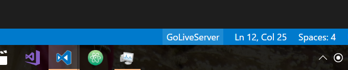

# LiveServer
Launch a Localhost Server directly from VSCode to your browser.  

## Usage
* press 'F1' or 'ctrl+shift+P' and type `Go Online Server` to start a server.
* press 'F1' or 'ctrl+shift+P' and type `Go Offline Server` to stop a server.
 OR,
* Directly Click `GoLiverServer` from StatusBar to turn off/on the server. 

## Features
* Live Server.
* Live Reload to browser.
* Click From StatusBar directly. 

## Dependency
* `live-server`

## LICENSE
[MIT License](./LICENSE)