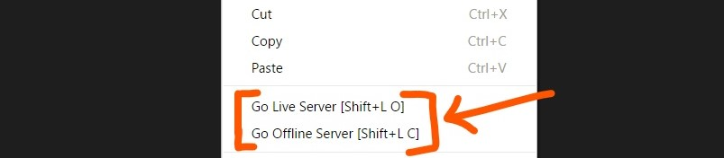

# Live Server
Launch a Local Server directly from VSCode to your browser and watch live preview of HTML 

## Usage/Shortcuts

**_[In case if you don't have any `.html` file in your workspace then you have to follow method no 3 & 4 to start Live Server. I don't know why you want so?! :p But features is still there.]_**

1. Open a HTML File/Project and directly Click to `Go Live` from StatusBar to turn off/on the server. 

2. Open a HTML file and Right click on the editor and choose the options.

3. Hit `(alt+L, O)` to Open the Server and `(alt+L, C)` to close the server. 

4. press `F1` or `ctrl+shift+P` and type `Live Server: Open Live Server ` to start a server or type `Live Server: Close Live Server` to stop a server.

## Features
* A Quick Development Live Server.
* Live Reload on change of files.
* Run the live server from status bar.
* Fixable Port Number.

## Settings
* `liveServer.settings.port` : Customize Port Number of your Live Server. Default value is `5500`.  If you want random port number, set it as `0`.

## Installation
Open VSCode Editor and Press `F1`  or `ctrl+shift+P`, type `ext install LiveServer`.

## What's new ?

#### Version 1.3.1 (03.07.17)
* File Extension detection issue is fixed, `Live Server` will be activated if there have atleast one HTML except in your `node_modoules` directory and description of extension updated as git repo name of the extension is updated to conventional name

#### Version 1.3.0 (02.07.17)
* `Go Live` option on Statusbar will be appeared if HTML Project file is opened.(Thanks _[Yu Zhang](https://github.com/neilsustc)_)

#### Version 1.2.0 (30.06.17)
* Settings for Customizing Port No of Live Server.
* Small UX updated.

## Changelog
Read from here to read full [changelog](CHANGELOG.md).

## LICENSE

This extension is licensed under the [MIT License](LICENSE)