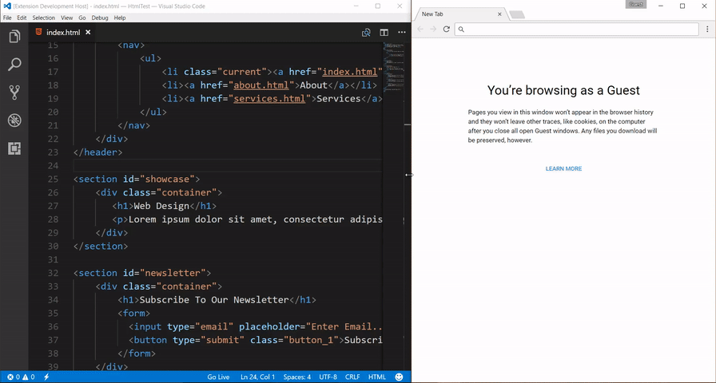
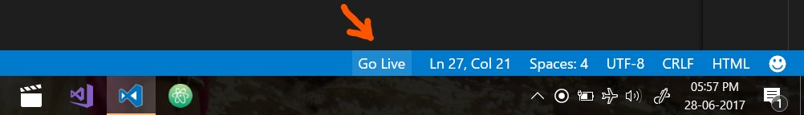
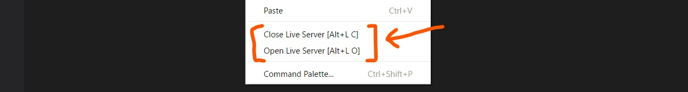

# Live Server

 
Launch a Local Server directly from VSCode to your browser and watch live preview of HTML 

## Usage/Shortcuts

**_[In case if you don't have any `.html` file in your workspace then you have to follow method no 3 & 4 to start Live Server. I don't know why you want so?! :p But features is still there.]_**

1. Open a HTML File/Project and directly Click to `Go Live` from StatusBar to turn off/on the server. 

2. Open a HTML file and Right click on the editor and choose the options.

3. Hit `(alt+L, O)` to Open the Server and `(alt+L, C)` to close the server. 

4. Press `F1` or `ctrl+shift+P` and type `Live Server: Open Live Server ` to start a server or type `Live Server: Close Live Server` to stop a server.

## Features
* A Quick Development Live Server.
* Live Reload on change of files.
* Run the live server from status bar.
* Fixable Port Number.
* Fixable Server Root.
* Fixable default browser.

## Settings
* `liveServer.settings.port` : Customize Port Number of your Live Server. Default value is `5500`.  If you want random port number, set it as `0`.
* `liveServer.settings.root` : To change root of server in between workspace folder structure,  use `/` and relative path from workspace. _Default value is "`/`".(The Workspace Root)_.
    * _Example: `/sub_folder1/sub_folder2`_. Now `sub_folder2` will be root of the server.

* `liveServer.settings.CustomBrowser` : To change your default browser. Default value is `Null`.

## Installation
Open VSCode Editor and Press `F1`  or `ctrl+shift+P`, type `ext install LiveServer`.

## What's new ?

#### Version 1.4.0 (04.07.17)
* Two new settings are added. <ul><li>1. `liveServer.settings.root` to change root of server in between workspace folder structure. (Thanks _[zorgoz](https://github.com/zorgoz)_ for the suggestion)</li> <li>2. `liveServer.settings.CustomBrowser` to change default browser.</li></ul> 
* Bug Fixed - `Cannot GET/ Error` when server starts with a html file located sub folder of root. (Thanks _[John Michael Robin](https://github.com/jmmrdev)_ for reporting the bug.)

#### Version 1.3.1 (03.07.17)
* File Extension detection issue is fixed, `Live Server` will be activated if there have atleast one HTML except in your `node_modoules` directory and description of extension updated as git repo name of the extension is updated to conventional name

#### Version 1.3.0 (02.07.17)
* `Go Live` option on Statusbar will be appeared if HTML Project file is opened.(Thanks _[Yu Zhang](https://github.com/neilsustc)_)

## Changelog
Read from here to read full [changelog](CHANGELOG.md).

## LICENSE

This extension is licensed under the [MIT License](LICENSE)